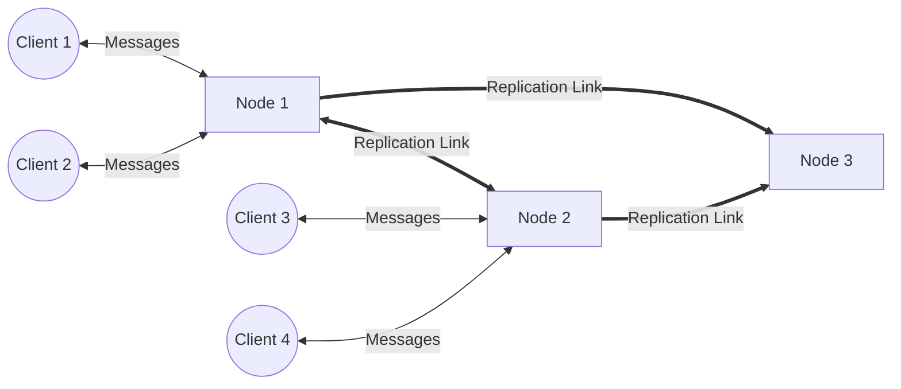

# Message Broker

This message broker can

* distribute text-based messages between multiple clients
* via separate topics
* with tolerance for temporary connection interruptions to clients
* with load balancing on Consumer Groups
* with high availability based on Leaderless Replication

## Feature Backlog

- [x] Topics
- [x] Consumer Groups
- [x] In-memory message queueing
    - After connecting, clients will receive messages of their subscriptions that arrived while the clients were
      disconnected
- [x] Cancel Subscriptions

## Quality Backlog

- [x] Introduce logging Library
- [x] Unit-Test ConsumerGroup.getNextClientProxyWithSocket
- [ ] HA via Leaderless Replication of Messages and Load Balancing
    - This drops strict ordering, because each node will construct its own message order
    - [x] Replication of all messages to all nodes
        - Config v1 (~~links are uni directional, every node has to know every node via config params~~)
            - [x] Nodes know about each other via IP:PORT config parameters
                - [x] On startup, nodes send replication requests to each other
        - Config v2
            - [x] Bidirectional links
            - [ ] Topology changes during runtime
                - [x] Nodes can join the cluster by connecting to any cluster node
                    - [x] it gets a list of all known nodes and establishes replication links
                    - [ ] Ensure a high consistency of cluster state
        - [x] Message Replication
            - [x] When a consumer group receives a message, it will be forwarded to replication receivers
            - [x] The replication receiver feeds all messages into its own replicated consumer groups
            - [x] Delivered messages are deleted cluster-wide
    - [ ] Cluster organizes the division of labour automatically
        - No manual configuration by admin needed
        - [ ] Topology changes for the distribution cluster
            - [ ] A node gets a first client of a consumer group
              - [x] Implemented for a first static two-node cluster
              - [ ] For testing, there has to be a way to configure DoL manually
            - [ ] A node looses its last client of a consumer group
            - [ ] A new node joins the cluster
            - [ ] A node leaves the cluster
    - [ ] Scenario: (On failure) clients connect to any node and message processing continues
        - [x] Subscription requests (consumer group to topic) have to be replicated
        - [ ] Subscription requests (client to consumer group) have to be replicated for recognition on connect
        - [ ] Unsubscribe requests (client to consumer group) have to be replicated

## Limitations

* Message order is preserved only roughly
* No persistence

# Concepts

## Leaderless Replication

Leaderless replication means, there is no central instance which decides or coordinates the data replication.
It's much more like a peer-to-peer architecture where all nodes accept incoming data from clients and replicate that
data
to other nodes. This increases the flexibility of a cluster. In general, this leads to a lower consistency. In this
particular case, it sacrifices the consistency of the message _ordering_.

## Division of Labour

When all nodes would deliver all messages to all of their clients, a message that gets submitted to the cluster, would
be
delivered multiple times, because all messages are replicated within the cluster. As messages should be delivered (
ideally)
exactly once within a consumer group, a new question arises: which messages should a node deliver to its clients?

Based on modular hashing, every node is able to determine if it should distribute a message or not. For example,
in a cluster with three distributor nodes, node N1 will be responsible for distributing all messages whose hashcode mod
3 is equals to zero.
N2 will distribute all messages whose hashcode mod 3 is equals to one and N3 distributes the messages whose hashcode mod
3 equals two.

Thus, although all messages are replicated within the cluster, the disjoint distribution to clients prevents multiple
delivery of messages.

## Glossary

* Client
    * Publishes or consumes messages
* Node
    * A process running message broker
* Topic
* ConsumerGroup
    * a set of Clients subscribed to a Topic

## Protocols

### Client --> Node

| Message Type  | Description                                                                      |
|---------------|----------------------------------------------------------------------------------|
| HI_MY_NAME_IS | A client introduces itself by telling its client id                              |
| SUB_REQ       | A client subscribes a ConsumerGroup to a Topic and oneself to that ConsumerGroup |
| UNSUB_REQ     | Inverse operation of SUB_REQ                                                     |
| MESSAGE       | A message published by a client                                                  |

### Node --> Node

| Message Type                    | Description                                                                                                                                        |
|---------------------------------|----------------------------------------------------------------------------------------------------------------------------------------------------|
| DELIVERED                       | Confirms that a message has been delivered to any client of a ConsumerGroup. (The receiver should delete the message locally)                      |
| REPLICATED_MESSAGE              | A MESSAGE that is replicated via the Replication Link                                                                                              |
| REPLICATED_SUBSCRIPTION_REQUEST | A SUB_REQ that is replicated via the Replication Link                                                                                              |
| WELCOME_TO_THE_HOOD             | Is sent from a cluster entry node to a new member. Contains a list of all cluster nodes and their network addresses for incoming Replication Links |
| INFO                            | A new node introduces itself by telling its node id and its address for incoming Replication Links                                                 |

# Lessons Learned

* Networking and concurrency increase the complexity (yes, we all knew this before, but I _felt_ it during
  development :-))
* My development approach "High-Level Unit Testing with TDD" is great for the cases that which you (can) think up
  upfront.
    * However, there are many cases which are not the leading cases for the happy path, but which have to be covered as
      well
    * Unexpected side effects might not be not discovered with TDD (e.g. unwanted duplicates)
* Changing cross-cutting concerns or redistributing responsibilities across classes **on demand** (the opposite strategy
  of designing them upfront) is possible
    * if you're the single author of a codebase. If multiple persons are working on the same codebase in parallel,
      things might work differently
* Interfaces on the level of the programming language can be expressed good enough with types and code comments.
    * For replication, network communication gets involved... How and where should this interface be documented?
* Class Diagrams help to visualize and question dependencies (if classes have meaningful names)
