# Message Broker

This message broker can

* distribute text-based messages between multiple clients
* via separate topics
* with tolerance for temporary connection interruptions to clients
* with load balancing on Consumer Groups
* with high availability based on Leaderless Replication

## Feature Backlog

- [x] Topics
- [x] Consumer Groups
- [x] In-memory message queueing
    - After connecting, clients will receive messages of their subscriptions that arrived while the clients were
      disconnected
- [x] Cancel Subscriptions

## Quality Backlog

- [x] Introduce logging Library
- [x] Unit-Test ConsumerGroup.getNextClientProxyWithSocket
- [ ] HA via Leaderless Replication of Messages and Load Balancing
    - This drops strict ordering, because each node will construct its own message order
    - [x] Replication of all messages to all nodes
        - Config v1 (~~links are uni directional, every node has to know every node via config params~~)
            - [x] Nodes know about each other via IP:PORT config parameters
                - [x] On startup, nodes send replication requests to each other
        - Config v2
            - [x] Bidirectional links
            - [ ] Topology changes during runtime
                - [x] Nodes can join the cluster by connecting to any cluster node
                    - [x] it gets a list of all known nodes and establishes replication links
                    - [ ] Ensure a high consistency of cluster state
        - [x] Message Replication
            - [x] When a consumer group receives a message, it will be forwarded to replication receivers
            - [x] The replication receiver feeds all messages into its own replicated consumer groups
            - [x] Delivered messages are deleted cluster-wide
    - [ ] Cluster organizes the division of labour automatically
        - No manual configuration by admin needed
        - [x] Topology changes for the distribution cluster
            - [ ] A node gets a first client of a consumer group
              - [x] Implemented for a first static two-node cluster
              - [x] For testing, there has to be a way to configure DoL manually
            - [ ] A node looses its last client of a consumer group
            - [x] A new node joins the cluster
            - [ ] A node leaves the cluster
        - [ ] Concurrency control for `REORG_DOL` sessions (currently, parallel `REORG_DOL` sessions can lead to undefined behaviour)
    - [ ] Scenario: (On failure) clients connect to any node and message processing continues
        - [x] Subscription requests (consumer group to topic) have to be replicated
        - [ ] Subscription requests (client to consumer group) have to be replicated for recognition on connect
        - [ ] Unsubscribe requests (client to consumer group) have to be replicated

## Limitations

* Message order is preserved only roughly
* No persistence

# Concepts

## Leaderless Replication
For better availability, messages are replicated within a cluster. In contrast to common implementations, this is not based on a leader node which controls the replication but it is more like a peer-to-peer architecture where all nodes accept messages and replicate them to each other.

```mermaid
graph LR;
    N1[Node 1]==>|🍏|N2[Node 2]
    N1==>|🍏|N3[Node 3]
    
    C1((Client 1))-->|🍏|N1;
    
    classDef c1 fill:#205781,color:white;
    classDef c2 fill:#4F959D,color:white;
    classDef c3 fill:#98D2C0;
    classDef c4 fill:#F6F8D5;
    class N1,N2,N3 c1
    class C1,C2,C3,C4 c3
```

## Division of Labour (DoL)
With replication, messages are copied to all nodes within the cluster. But only a single one of these nodes should deliver a message to a client. Therefore, some kind of logic is needed to clarify which node should distribute which messages to clients.

Based on modular hashing of the message itself, every node is able to determine if it should distribute a message or not. For example,
in a cluster with three distributor nodes, node N1 will be responsible for distributing all messages whose hashcode mod
3 is equal to zero.
N2 will distribute all messages whose hashcode mod 3 is equals to one and N3 distributes the messages whose hashcode mod
3 equals two.

Thus, although all messages are replicated within the cluster, the delivery to clients happens only once.

```mermaid
graph LR;
    N1[Node 1]==>|🍏,🍊|N2[Node 2]
    N1==>|🍏,🍊|N3[Node 3]
    
    C1((Client 1))-->|🍏,🍊|N1;
    N2-->|🍏|C2((Client 2));
    N3-->|🍊|C3((Client 3));
    
    classDef c1 fill:#205781,color:white;
    classDef c2 fill:#4F959D,color:white;
    classDef c3 fill:#98D2C0;
    classDef c4 fill:#F6F8D5;
    class N1,N2,N3 c1
    class C1,C2,C3,C4 c3
```

(Idea: use message length instead of hashCode?)

### Automatic (Re)Organization of Devision of Labour
When a node becomes a distributor of a CG, the DoL has to be negotiated again.
This process is called a `REORG_DOL` session. When a session is finished, every node knows which messages it is responsible for. Events that trigger a reorganization are
* A node gets a first client of a consumer group = becomes a distributor 
* A node looses its last client of a consumer group = stops being a distributor

When a node gets a first client of a consumer group, a `REORG_DOL` session will be initiated by sending a random number to all other nodes.
Every receiver node will reply by sending its own random number to all other nodes. After this short burst of exchange of random numbers, every node received every random number of all other nodes. Now, just by sorting the random numbers, every node knows its index within the sorted list of random numbers.

## Glossary

| Term                 | Description                                                                                                                 |
|----------------------|-----------------------------------------------------------------------------------------------------------------------------|
| Client               | Can  -  Consume or publish messages  - Subscribe itself to a consumer group  - Assign consumer groups to topics |
| Node                 | A process running message broker, can join a cluster and establish replication links                                        |
| Topic                |                                                                                                                             |
| ConsumerGroup (CG)   | a set of Clients subscribed to a Topic                                                                                      |
| Message Distribution | Used in the context of sending messages from nodes to clients. Not used in the context of replication.                      |
| Subscription         | A clients communicates its interest in a topic by subscribing to a consumer group.                                          |
| Replication Link     | Bi-directional communication channel between nodes.                                                                         |

## Protocols

### Client <-> Node

| Message Type  | Description                                                                      |
|---------------|----------------------------------------------------------------------------------|
| HI_MY_NAME_IS | A client introduces itself by telling its client id                              |
| SUB_REQ       | A client subscribes a ConsumerGroup to a Topic and oneself to that ConsumerGroup |
| UNSUB_REQ     | Inverse operation of SUB_REQ                                                     |
| MESSAGE       | A message published by a client                                                  |

### Node <-> Node (Replication Link)

| Message Type                    | Description                                                                                                                                        |
|---------------------------------|----------------------------------------------------------------------------------------------------------------------------------------------------|
| DELIVERED                       | Confirms that a message has been delivered to any client of a ConsumerGroup. (The receiver should delete the message locally)                      |
| REPLICATED_MESSAGE              | A MESSAGE that is replicated via the Replication Link                                                                                              |
| REPLICATED_SUBSCRIPTION_REQUEST | A SUB_REQ that is replicated via the Replication Link                                                                                              |
| WELCOME_TO_THE_HOOD             | Is sent from a cluster entry node to a new member. Contains a list of all cluster nodes and their network addresses for incoming Replication Links |
| INFO                            | A new node introduces itself by telling its node id and its address for incoming Replication Links                                                 |

# Lessons Learned

* Networking and concurrency increase the complexity (yes, we all knew this before, but I _felt_ it during
  development :-))
* My development approach "High-Level Unit Testing with TDD" is great for the cases that which you (can) think up
  upfront.
    * However, there are many cases which are not the leading cases for the happy path, but which have to be covered as
      well
    * Unexpected side effects might not be not discovered with TDD (e.g. unwanted duplicates)
* Changing cross-cutting concerns or redistributing responsibilities across classes **on demand** (the opposite strategy
  of designing them upfront) is possible
    * if you're the single author of a codebase. If multiple persons are working on the same codebase in parallel,
      things might work differently
* Interfaces on the level of the programming language can be expressed good enough with types and code comments.
    * When communication over network comes into the game, documentation has to cover additional aspects such as serialization. This is a good reason to stay on a lower level of interfaces and avoid networking at all.
* Class Diagrams help to visualize and question dependencies (if classes have meaningful names)
* Sockets can get into closed state, although it still contains unread data
* In the beginning, something is created in a separate class. As the class grows, we start to extract parts that belong together into other classes which act as collaborators. 
  After a few iterations, the amount of code logic the initial class decreases more and more until it becomes a facade whose only purpose is to forward calls to the collaborators. During that transformation, code migrates from one class to another one. Applying the rule "every class should have a corresponding unit-test class" complicates that transformation process, because of continuous adjustments of unit tests. 
* In the beginning, one layer seems to be a good layer to write tests against. Over time, complexity hidden by the layers interface grows silently. Every iteration of development adds a little bit to the interface
  * The tests become hard to maintain, when too many implementation details leak out of the class 
  * A common approach is to limit the scope of tests by mocking out other modules
* Classes grow, because the interface grows
  * I extended the central `Broker`-class with methods that provide insights into the broker. These methods are not needed for the broker to perform its origin task but to make testing easier. The common approach for (unit) testing is to
execute the same code that is used in prod - but with defined inputs and asserted outputs. In contrast, the approach I used does not (only) rely on the observable behaviour when the broker performs its original task but performs assertions
on the internal state of the broker. You could argue that this is some sort of whitebox testing or testing with a dedicated testing interface.
* A good reason to extend an existing class is that it keeps staying one thing
  * Splitting it into two things requires a decision - where to cut. It might turn out that the cutting line was a bad one. No one wants to be the person to be blamed for that decision. 
  * Finding an agreement within a team on the cutting line is not a preferred task.
  * Decomposition of classes is a structural change and brings a higher probability to cause merge conflicts with other development tasks
  * After decomposition, multiple people have to learn the new structure (the decomposition invalidates the mental model)
* A good reason to extend an existing class is
  * When the class serves as an entry point (Façade) of a module and the interface is extended, the class has to be extended. This extends the width of the interface of the class but not the volume of code that implements the interface. The implementations are delegates.
* In concurrent scenarios, just looking at the end result is not enough. Verification of the intermediate steps is required, because faulty behavior in the inner might still produce correct results in the end. For now, that's fine but in the future, this might cause unwanted side effects.

## Observability
How to get state data from the broker into a GUI? Approaches:
1) JavaFX
2) Sidecar with HTTP/Websocket Server and GUI which receives stats via the broker protocol
